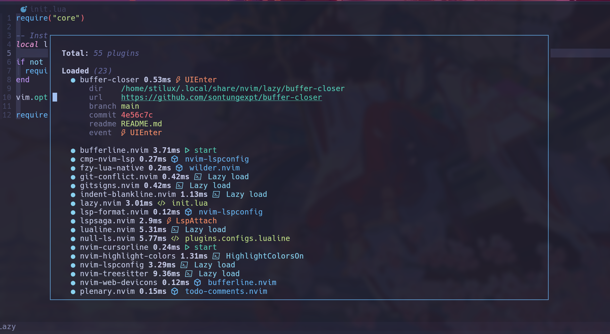
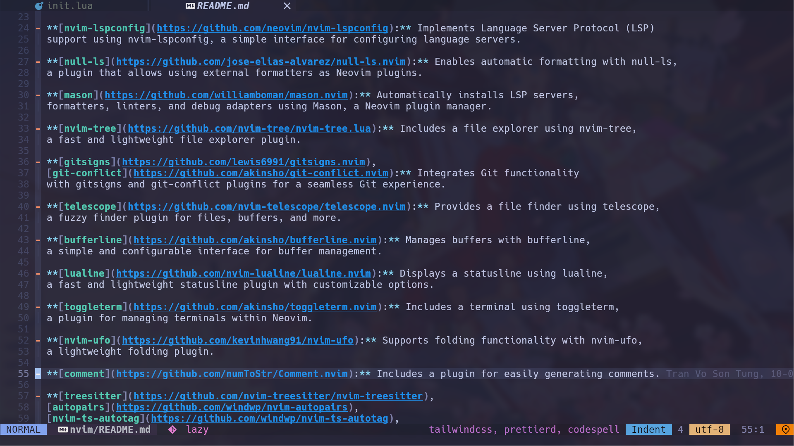

## Introduction

This plugin allow you to open url under cursor in neovim without netrw with
default browser of your system.

NOTE: Since I am the linux user so i only test this plugin on linux, if you
are using macos or windows and you have any problem with this plugin, please
open an issue or create a pull request to fix it

- [Features](#features)
- [Installation](#installation)
- [Configuration](#configuration)
- [Usage](#usage)
- [Contributing](#contributing)
- [License](#license)

<!--toc:end-->

## Features

- Highlight all urls in the buffer and highlight url that can be opened when cursor move over it
- Open the url under cursor include markdown link (e.g. `https://github.com/sontungexpt/url-open`)
- Open the github page of neovim plugin name under cursor (e.g. `Plug 'nvim-lua/plenary.nvim'`, "sontungexpt/url-open")
- Open the npm package in package.json (e.g. `"lodash": "^4.17.21",`)
- Support brew formula, and cask
- Support deep pattern (disabled by default) to match with url below
  - http://example.com
  - https://www.example.com
  - ftp://ftp.example.com
  - file:///path/to/file.txt
  - ssh://user@hostname
  - git://github.com/user/repo
  - http://example.com/path?param=value
  - https://www.example.com/another/path#section
  - http://example.com:8080
  - https://www.example.com:8443
  - ftp://ftp.example.com:2121
- Allow you to open url from anywhere in the line if it only contains 1 url

## Preview

- Highlight url which can be opened then you can open it by `:OpenUrlUnderCursor`





https://github.com/sontungexpt/url-open/assets/92097639/9b4fe61a-b948-470c-a1df-cd16dea706e7

https://github.com/sontungexpt/url-open/assets/92097639/c51b3e1c-8eae-48f0-a542-e16205fd00f9

## Installation

```lua
-- lazy.nvim
{
	"sontungexpt/url-open",
    event = "VeryLazy"
	cmd = "OpenUrlUnderCursor",
	config = function()
		local status_ok, url_open = pcall(require, "url-open")
		if not status_ok then
			return
		end
		url_open.setup ({})
	end,
},
```

- NOTE: If you want to use minimal source with no commnets, no validate configs,
  you can use branch `mini` instead of `main` branch. Make sure you know that your config is valid

```lua
-- lazy.nvim
{
	"sontungexpt/url-open",
    branch = "mini",
    event = "VeryLazy"
	cmd = "OpenUrlUnderCursor",
	config = function()
		local status_ok, url_open = pcall(require, "url-open")
		if not status_ok then
			return
		end
		url_open.setup ({})
	end,
},
```

## Configuration

You can easily add more patterns to open url under cursor by adding more patterns to `extra_patterns` config

```lua
-- default values
require("url_open").setup({
    -- if true, only open url when cursor in the middle of url
    -- if false, open next url found from cursor position it means you can open
    -- url even when the cursor is in front of url or in the middle of url
	open_app = "default",
	-- default will open url with default browser of your system or you can choose your browser like this
	-- open_app = "micorsoft-edge-stable",
	-- google-chrome, firefox, micorsoft-edge-stable, opera, brave, vivaldi
	open_only_when_cursor_on_url = false,
	highlight_url = {
		all_urls = {
			enabled = false,
			fg = "#19d5ff", -- nil will use default color
			bg = nil, -- transparent
			underline = true,
            -- more_customize via vim.api.nvim_set_hl
		},
		cursor_move = {
			enabled = true,
			fg = "#199eff", -- nil will use default color
			bg = nil, -- transparent
			underline = true,
            -- more_customize via vim.api.nvim_set_hl
		},
	},
	deep_pattern = false,
	extra_patterns = {
		-- [pattern] = prefix: string only or nil
		-- [pattern] = {prefix = "", suffix = ""},
		--
		-- E.g: ['["]([^%s]*)["]:'] = "https://www.npmjs.com/package/",
		-- so the url will be https://www.npmjs.com/package/<pattern found>
		--
		-- E.g: ['["]([^%s]*)["]:'] = {prefix = "https://www.npmjs.com/package/", suffix = "/issues"},
		-- so the url will be https://www.npmjs.com/package/<pattern found>/issues
	},
})
```

## Usage

- This plugin provide a command `:OpenUrlUnderCursor` to open url under cursor

- This plugin will not map any key by default, you can map it by yourself

```lua
vim.keymap.set("n", "gx", "<esc>:OpenUrlUnderCursor<cr>")
```

## Contributing

Pull requests are welcome. For major changes, please open an issue first to discuss what you would like to change.

## License

This project is licensed under the MIT License - see the [LICENSE](LICENSE) file for details
